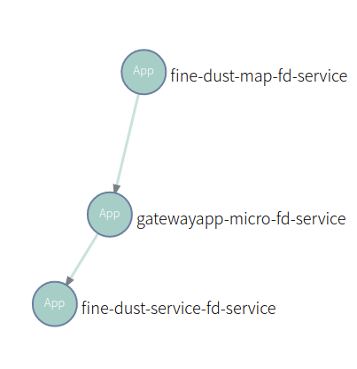
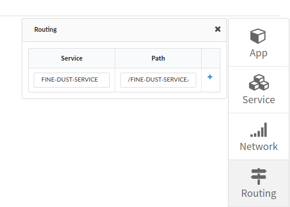
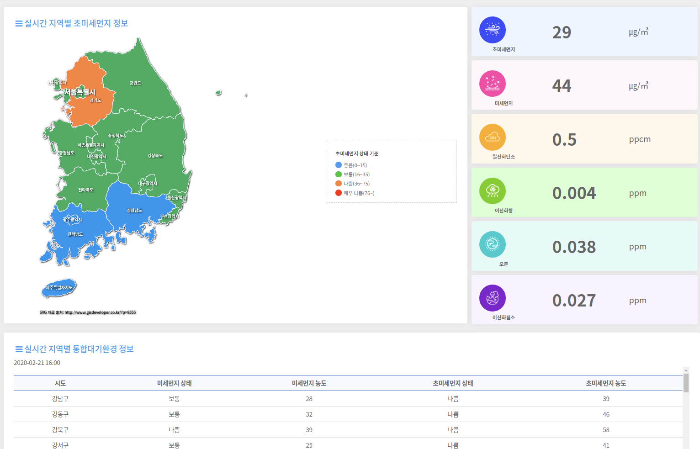
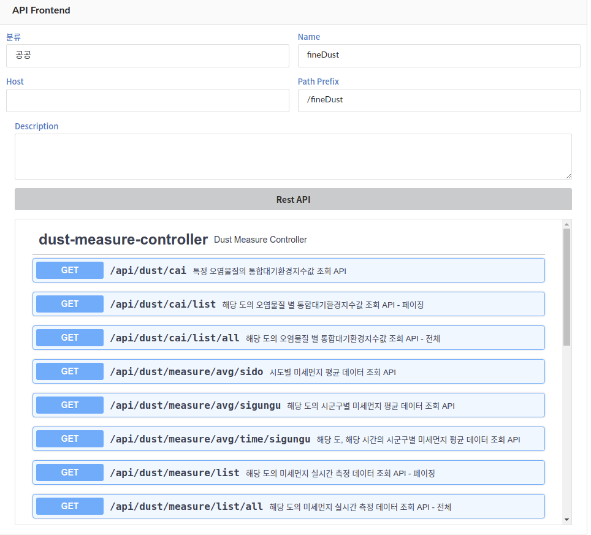

# 목차

1. [**MavenBuild**](https://github.com/startupcloudplatform/fine-dust#maven-build)
2. [**manifest.yml 작성**](https://github.com/startupcloudplatform/fine-dust#manifestyml-작성)
3. [**cf push**](https://github.com/startupcloudplatform/fine-dust#cf-push)
4. [**마이크로서비스 구성 방법**](https://github.com/startupcloudplatform/fine-dust#마이크로서비스-구성방법)
5. [**최종 결과 화면**](https://github.com/startupcloudplatform/fine-dust#최종-결과화면)


------

### Maven Build

각 프로젝트 폴더로 이동하여 maven 빌드를 통해 jar파일 생성

```
mvn clean package
```


### Manifest.yml 작성

```
---
applications:
  - name: (cf에 push되는 앱 이름)
    memory: 1G
    path: (jar파일이 있는 경로)/(jar파일).jar
    buildpack: java_buildpack
    env:
      msa: yes
      private: (paasta 계정 id)
      
ex)   
---
applications:
  - name: 
    memory: 1G
    path: target/
    buildpack: java_buildpack
    env:
      msa: yes
      private: test
```


### cf push

사용할 조직과 영역을 생성하고, 타겟을 설정한다.

 준비해 둔 manifest.yml파일과 jar파일을 이요하여 cf 상에 앱을 push 한다.

 앱 push 후에 [MicroStudio](http://203.245.1.101:8080/login)를 이용하여 마이크로서비스 구성

```
# cf 조직 생성
cf create-org (생성할조직 이름)
ex) cf create-org sample-org

# cf 스페이스 생성
cf create-space (생성할 스페이스 이름) -o (생성된 조직 이름)
ex) cf create-space sample-space -o sample-org

# cf target 설정
cf target -o (조직이름) -s (스페이스이름)
ex) cf target -o sample-org -s sample-space

# cf에 application 배포
ex) cf push --no-start
```


### 마이크로서비스 구성방법

- 서비스 간 연결 구조



- 라우팅 설정

  


### 최종 결과화면

- 미세먼지와 기타 환경 오염 내용을 확인할 수 있습니다.




- 사용 가능한 API목록



